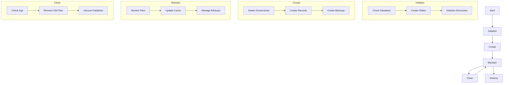
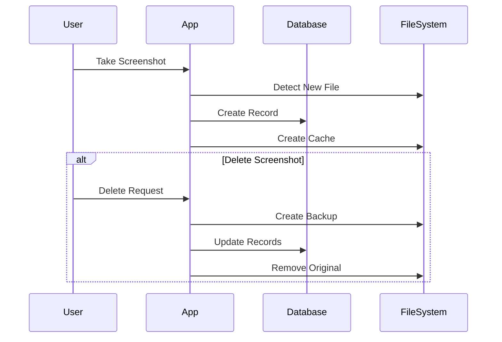
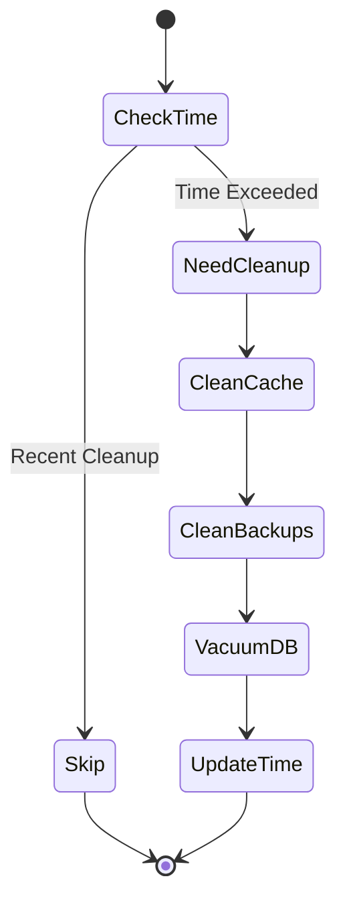
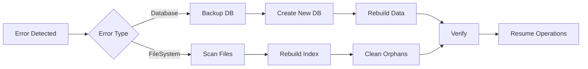

# Data Lifecycle Management

This document describes the complete lifecycle of data in the Screen Cut application, including initialization, maintenance, and cleanup processes.

## Flow Diagrams

### Overall Data Lifecycle


### Screenshot Management Flow


### Cleanup Process Flow


### Error Recovery Flow


## Data Structure

### Database Tables

1. **files**
   ```sql
   CREATE TABLE IF NOT EXISTS files (
     path TEXT PRIMARY KEY,
     size INTEGER NOT NULL,
     mtime TEXT,
     last_accessed INTEGER
   )
   ```

2. **backups**
   ```sql
   CREATE TABLE IF NOT EXISTS backups (
     id INTEGER PRIMARY KEY AUTOINCREMENT,
     backup_path TEXT NOT NULL,
     original_path TEXT NOT NULL,
     size INTEGER NOT NULL,
     backup_time INTEGER NOT NULL
   )
   ```

3. **deleted_files**
   ```sql
   CREATE TABLE IF NOT EXISTS deleted_files (
     path TEXT PRIMARY KEY,
     deleted_at INTEGER NOT NULL,
     backup_path TEXT NOT NULL,
     size INTEGER NOT NULL
   )
   ```

4. **settings**
   ```sql
   CREATE TABLE IF NOT EXISTS settings (
     key TEXT PRIMARY KEY,
     value TEXT NOT NULL
   )
   ```

## Data Lifecycle

### 1. Initialization

#### Database Initialization
1. Check if database file exists at `CONFIG.dbPath`
2. Create database file if it doesn't exist
3. Create required tables if they don't exist
4. Initialize settings table with default values

#### File System Initialization
1. Create necessary directories:
   - Config directory
   - Cache directory
   - Backup directory
2. Set appropriate permissions
3. Initialize pnpm workspace and dependencies

### 2. Data Creation

#### Screenshot Detection
1. Monitor configured directories for new screenshots
2. Validate file patterns against configured patterns
3. Add new files to the database

#### Backup Creation
1. Create backup when file is deleted
2. Store backup file in backup directory
3. Record backup information in database

#### Cache Creation
1. Create cache entries for frequently accessed data
2. Store cache files in cache directory
3. Track cache usage and size

### 3. Data Maintenance

#### Regular Cleanup
1. Check last cleanup time from settings
2. If cleanup interval exceeded:
   - Clean old cache files
   - Remove expired backups
   - Vacuum database

#### Cache Management
1. Monitor cache size
2. Remove oldest cache files when size limit exceeded
3. Update cache access timestamps

#### Backup Management
1. Track number of backup sets
2. Remove oldest backups when limit exceeded
3. Clean up orphaned backup files

### 4. Data Cleanup

#### Cache Cleanup Process
```typescript
async cleanupCache(): Promise<void> {
  const cutoffTime = Date.now() - CONFIG.maxCacheAge;
  const oldFiles = await this.getFilesByDate(cutoffTime);
  
  for (const file of oldFiles) {
    await this.deleteFile(file.path);
  }
}
```

#### Backup Cleanup Process
```typescript
async cleanupBackups(): Promise<void> {
  const cutoffTime = Date.now() - CONFIG.maxBackupAge;
  const backups = await this.getBackups();
  
  // Remove old backups
  const oldBackups = backups.filter(b => b.createdAt < cutoffTime);
  for (const backup of oldBackups) {
    await this.removeBackup(backup.backupPath);
  }
  
  // Enforce maximum backup sets
  if (backups.length > CONFIG.maxBackupSets) {
    const excessBackups = backups
      .sort((a, b) => b.createdAt - a.createdAt)
      .slice(CONFIG.maxBackupSets);
    
    for (const backup of excessBackups) {
      await this.removeBackup(backup.backupPath);
    }
  }
}
```

### 5. Data Destruction

#### File Deletion
1. Move file to backup location
2. Create backup record
3. Remove file record from files table
4. Add record to deleted_files table

#### Backup Deletion
1. Remove backup file from filesystem
2. Remove backup record from backups table
3. Update related deleted_files records

#### Cache Deletion
1. Remove cache file from filesystem
2. Remove cache metadata from database

## Maintenance Schedule

| Operation | Default Interval | Configurable |
|-----------|-----------------|--------------|
| Cache Cleanup | 7 days | Yes |
| Backup Cleanup | 30 days | Yes |
| Database Vacuum | 7 days | Yes |

## Error Handling

### Database Errors
1. Connection errors
   - Retry with exponential backoff
   - Create new database if corrupted

2. Transaction errors
   - Rollback on failure
   - Log error details
   - Maintain data consistency

### File System Errors
1. File access errors
   - Check permissions
   - Create missing directories
   - Log access failures

2. Storage errors
   - Monitor free space
   - Clean up when space is low
   - Alert on critical storage issues

## Best Practices

1. **Data Consistency**
   - Use transactions for related operations
   - Verify file existence before operations
   - Maintain referential integrity

2. **Performance**
   - Index frequently queried fields
   - Batch operations when possible
   - Regular database maintenance

3. **Security**
   - Validate file paths
   - Sanitize user inputs
   - Maintain secure file permissions

4. **Monitoring**
   - Track cleanup operations
   - Monitor storage usage
   - Log important events

## Recovery Procedures

### Database Recovery
1. Backup corrupt database
2. Create new database
3. Rebuild from filesystem scan

### File System Recovery
1. Scan for orphaned files
2. Rebuild database entries
3. Clean up invalid references

## Configuration

All lifecycle parameters can be configured in `src/config/index.ts`:

```typescript
export const CONFIG = {
  maxCacheAge: 7 * 24 * 60 * 60 * 1000,  // 7 days
  maxBackupAge: 30 * 24 * 60 * 60 * 1000, // 30 days
  maxBackupSets: 10,
  cacheCleanupInterval: 24 * 60 * 60 * 1000, // 24 hours
  maxCacheSize: 1024 * 1024 * 1024, // 1GB
  databaseVacuumInterval: 7 * 24 * 60 * 60 * 1000 // 7 days
};
```
