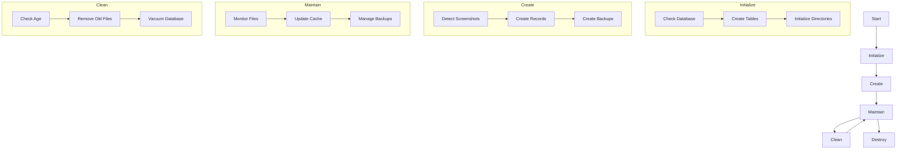
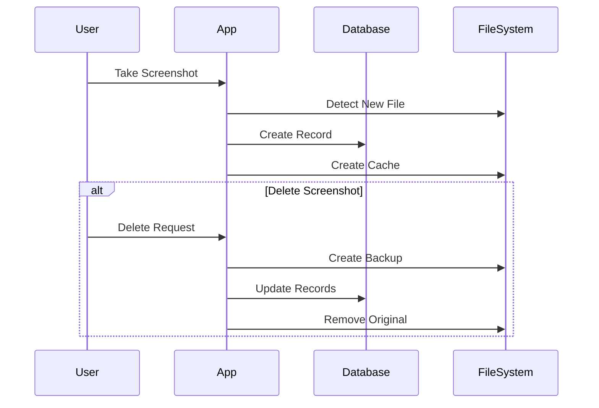
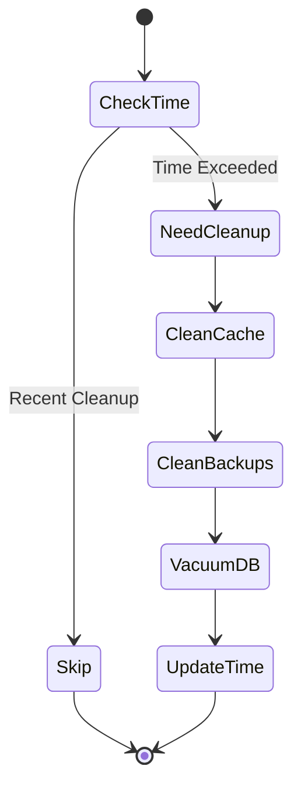
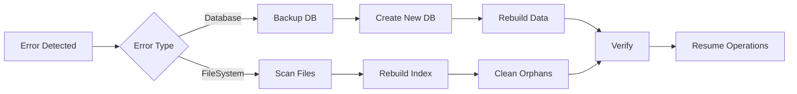

# Screen Cut Flow Diagrams

This document contains all the flow diagrams illustrating the data lifecycle and processes in the Screen Cut application.

## Data Lifecycle Overview

## Screenshot Management Flow

## Cleanup Process Flow

## Error Recovery Flow

## Flow Descriptions

### Data Lifecycle Overview
This diagram shows the complete lifecycle of data in the application:
- Initialization phase (database and directory setup)
- Data creation (screenshot detection and recording)
- Maintenance (ongoing file and cache management)
- Cleanup (automatic removal of old data)
- Destruction (file deletion and backup management)

### Screenshot Management Flow
This sequence diagram illustrates the interaction between:
- User actions
- Application logic
- Database operations
- File system operations

It shows both the creation and deletion flows for screenshots.

### Cleanup Process Flow
This state diagram shows the automatic cleanup process:
- Time-based triggers
- Cache cleanup
- Backup management
- Database optimization
- Status updates

### Error Recovery Flow
This flowchart shows how the system handles and recovers from errors:
- Error detection
- Different recovery paths for database and filesystem errors
- Data verification
- System restoration

## Notes

These diagrams use Mermaid syntax and can be viewed in any Markdown viewer that supports Mermaid diagrams. If you're viewing this in a plain text editor, you can copy the diagram code and paste it into the [Mermaid Live Editor](https://mermaid.live) to see the rendered version.
